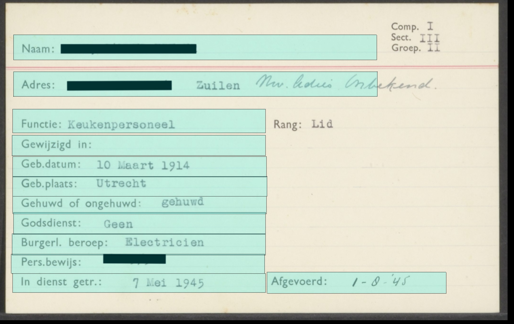

# TaggingTemplate
Processing code for marking areas on a scan for tagging/annotate purposes.

Use Shift+click to mark an area. Press 's' to save. Press 'c' to clear.

After marking the areas edit data/settings.csv to enter the names/labels/tags. Optionally add a regex in the 'remove' column.

